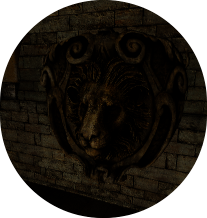
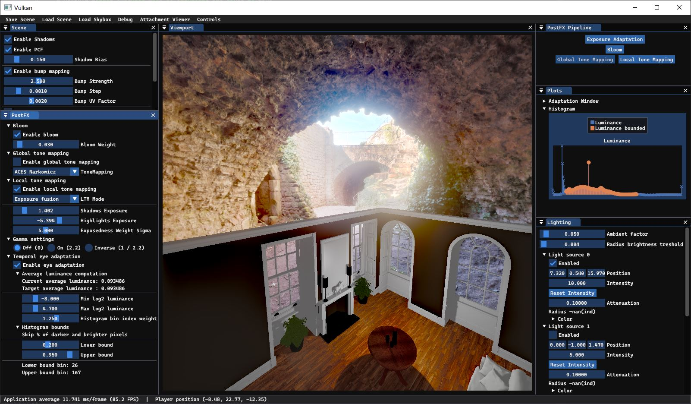
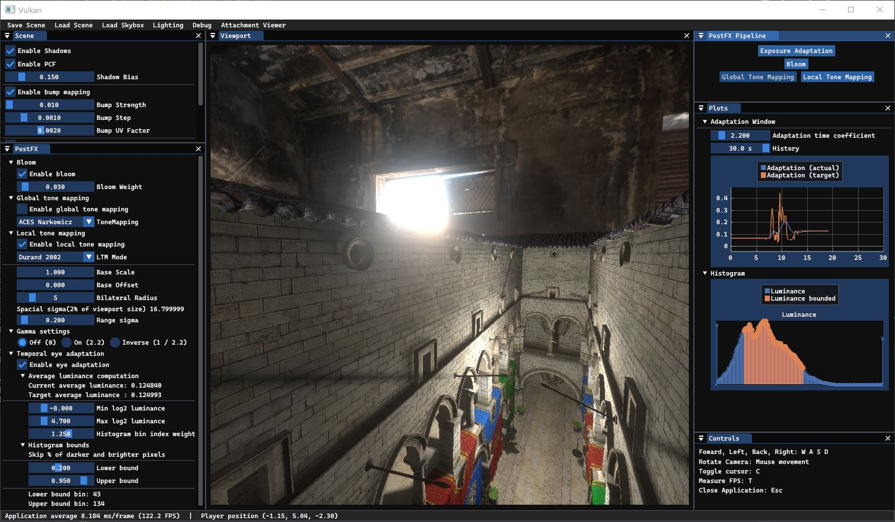
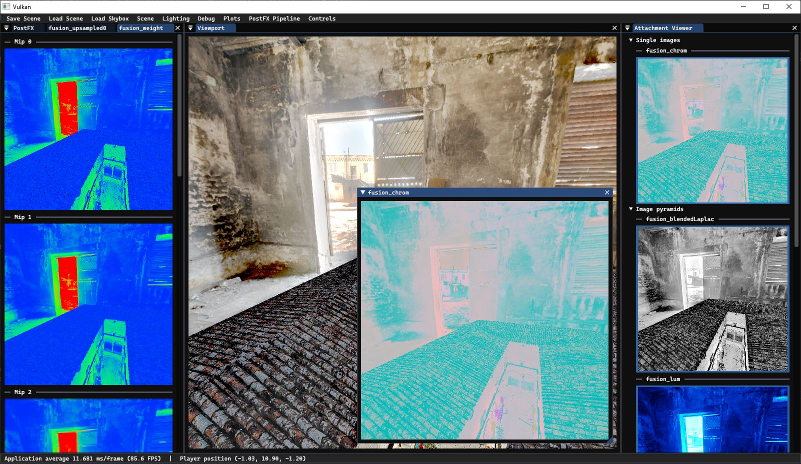

# vulkan-hdr-demo

<p align="center">
  
</p>

## About
This repository contains a 3D renderer Vulkan demo application. It serves purpose to demonstrate several HDR rendering techniques such as: uniform (global) and spatially-variant tone mapping, dynamic exposure adaptation, exposure fusion and bloom.

The project is written in C++20 and uses ImGUI for the user interface.

### Current functionality:
* Camera movement `W, A, S, D, Shift(down), Space(up)`
* Model loading: `.obj` with `materials` and `diffuse textures`.
* Several global tone mapping algorithms: `Reinhard`, `ACES`, `Uncharted2`.
* Dynamic exposure adaptation: `using luminance histogram`.
* `Exposure Fusion`.
* Smooth Bloom effect: `computed by blurring the image on multiple mip levels and them recursively upsapmpling`.
* UI for scene configuration: `ImGui`.
* Dynamic shadows: `omnidirectional shadow mapping`.
* Scene Save/Load: `JSON format`.
* HDR skybox cubemap loading: `32-bit float`.
* Phong lighting model: `several point lights with configurable position, intensity, attenuation etc`.
* Bump mapping: `bump maps`.
* etc.

## Compilation
For the project configuration CMake build system is used. 

* Please note that currently the program may not work correctly on `Linux`. Not enough testing was done.

* To make things easy, there are python scripts to help build and run the program: `scripts/win-build-n-run.py`, `scripts/linux-build-n-run.py` that will configure, build and run the application.

* `CMake will try to find Vulkan on your system`. In case it cannot find Vulkan, the bundled version that is supplied with this repository will be used. 

## Manual compilation on Windows:

### Configure the project with CMake:

```
cmake -S . -B .
```

### Compile:

On Windows:

Open generated Visual Studio `solution` and build the project or use `msbuild.exe` to build the project from command line. 

* If `msbuild` is not in your PATH variable or you don't know where msbuild is located on your device, try running it from `x64 Native Tools Command Prompt for VS 20XX`. Also, usually `MsBuild.exe` is located at path: `C:\Program Files\Microsoft Visual Studio\2022\Community\MSBuild\Current\Bin\MsBuild.exe`

Build the program in release mode:
```
msbuild vulkan-hdr-demo.sln /t:Build /p:Configuration=Release
```

* But be aware that the solution or executable name might change in the future.

* All shaders are compiled automatically every time the project is built using the python script `scripts/compile_shaders.py`. Pay attention (!) to the build output to see if there are any `errors` when shaders are built. 
If the script fails try to run it manually or manually compile the shaders using `glslc` from `.\external\shaderc\glslc.exe`. 

## Manual compilation on Linux:

```
cmake -S . -B linux-build -DCMAKE_BUILD_TYPE=Release
cd linux-build
make
```

## Usage

You can run the program from command line, or from Visual Studio (in case of Windows). 

* **You must run the application executable from the `project root folder` otherwise the working directory will be invalid and the program will fail to open the assets!** Make sure to run the executable from the same folder, where `assets/` are located!
* You can also supply the `working directory` with command line argument, see section below.

### Windows:

```
.\vkdemo.exe
```

### Linux:

```
./vkdemo ..
```

Argument passed specifies the working directory. If the executable is located in `linux-build`, it is necessary to change the working directory to root (i.e. where `assets/` is).

## Arguments:

```
vkdemo <WORK_DIR>

    WORK_DIR - if this OPTIONAL argument is supplied, the working directory will be set to <WORK_DIR>. Otherwise the working directory is by default set to the folder from which the executable was run. 
```

## Libraries/Resources Used
### Libraries
* [Vulkan SDK](https://vulkan.lunarg.com/)
* [GLFW](https://www.glfw.org/)
* [GLM](https://glm.g-truc.net/0.9.9/index.html)
* [stb_image](https://github.com/nothings/stb/blob/master/stb_image.h)
* [tinyobj](https://github.com/tinyobjloader/tinyobjloader)
* [Vulkan Memory Allocator by AMD](https://github.com/GPUOpen-LibrariesAndSDKs/VulkanMemoryAllocator)
* [ImGui](https://github.com/ocornut/imgui)
* [ImPlot](https://github.com/epezent/implot)
* [JSON for Modern C++](https://github.com/nlohmann/json)
* TODO:

### Web pages
A lot of resources where used to learn Vulkan API.

Here are the main ones:
* [vulkan-guide by vblanco20-1](https://vkguide.dev/)
* [Vulkan Tutorial in Czech language by Jan Pečiva](https://www.root.cz/serialy/tutorial-vulkan/)
* [Vulkan Tutorial by Alexander Overvoorde](https://vulkan-tutorial.com/)
* [LearnOpenGL by Joey de Vries](https://learnopengl.com/)
* TODO:

Following are the repositories from which some code was taken as-is or with modifications. Authors are also attributed in the source code:
* [vulkan-guide repository by vblanco20-1](https://github.com/vblanco20-1/vulkan-guide)
* [VulkanTutorial repository by Jan Pečiva](https://github.com/pc-john/VulkanTutorial)
* [Vulkan examples by Sascha Willems](https://github.com/SaschaWillems/Vulkan)
* TODO:

### Assets
Assets used and information about them can be found in `assets/` folder and subfolders.

Usually each model's folder contains some `(LICENSE|copyright).txt` file.

### Application screenshots






