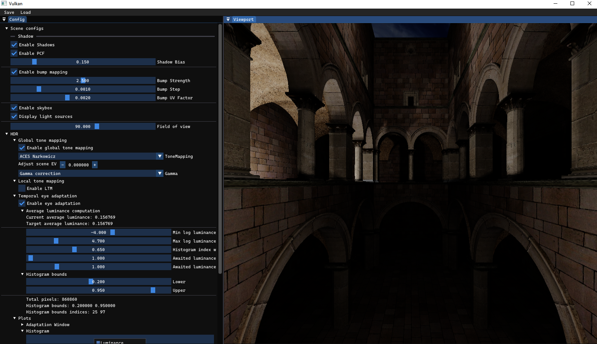
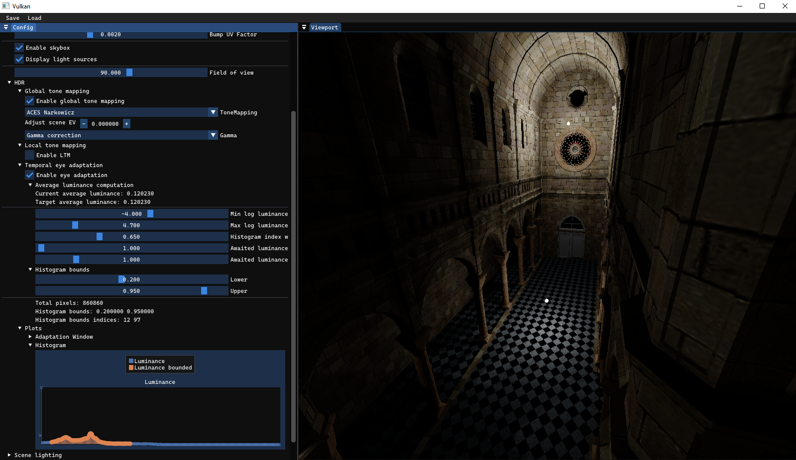

# vulkan-hdr-demo

<p align="center">
  
</p>

## About
This repository contains a 3D renderer, that uses Vulkan API and is written in C++.

**Note: Project is still actively being worked on, thus it may contain a lot of commented code sections, lack appropriate comments and can be unintuitive to use**.

### Current functionality:
* Camera movement `W, A, S, D, Shift(down), Space(up)`
* Model loading: `.obj` with `materials` and `diffuse textures`.
* Texture loading: `RGBA`.
* HDR skybox cubemap loading: `32-bit float`.
* Phong lighting model: `several point lights with configurable position, intensity, attenuation etc`.
* Several global tone mapping algorithms: `Reinhard`, `ACES`, `Uncharted2` etc.
* Dynamic exposure adaptation: `using luminance histogram`.
* UI for scene configuration: `ImGui`.
* Dynamic shadows: `omnidirectional shadow mapping`.
* Scene Save/Load: `JSON format`.
* Bump mapping: `bump maps`.

## Compilation
For cross-platform compilation it uses CMake build system. Platforms currently supported: `Windows, Linux`.

### Configure the project with CMake:
```
cmake -S . -B build
```

### Compile:

On Linux:
```
cd build
make
```
On Windows:

Open generated Visual Studio solution and build the project or open `x64 Native Tools Command Prompt for VS 20XX` and run:
```
msbuild vulkan-hdr-demo.sln
```
then to run:
```
build\Debug\vkdemo.exe
```
But be aware that the solution or executable name may change in future.

All shaders are compiled automatically when the project is built using the python script `compile_shaders.py`.
## Usage
The compiled executable is `vkdemo` or `vkdemo.exe`.

**You must run it from `root folder` otherwise the paths to assets will be wrong!**

You can run it from command line, or on Windows also from Visual Studio.

## Libraries/Resources Used
### Libraries
* [Vulkan SDK](https://vulkan.lunarg.com/)
* [GLFW](https://www.glfw.org/)
* [GLM](https://glm.g-truc.net/0.9.9/index.html)
* [stb_image](https://github.com/nothings/stb/blob/master/stb_image.h)
* [tinyobj](https://github.com/tinyobjloader/tinyobjloader)
* [Vulkan Memory Allocator by AMD](https://github.com/GPUOpen-LibrariesAndSDKs/VulkanMemoryAllocator)
* [ImGui](https://github.com/ocornut/imgui)
* [ImPlot](https://github.com/epezent/implot)
* [JSON for Modern C++](https://github.com/nlohmann/json)

### Web pages
As this is mainly a personal learning project, a lot of resources where used to learn Vulkan API.

Here are the main ones:
* [vulkan-guide by vblanco20-1](https://vkguide.dev/)
* [Vulkan Tutorial in Czech language by Jan Pečiva](https://www.root.cz/serialy/tutorial-vulkan/)
* [Vulkan Tutorial by Alexander Overvoorde](https://vulkan-tutorial.com/)
* [LearnOpenGL by Joey de Vries](https://learnopengl.com/)

Following are the repositories from which some code was taken as-is or with modifications. Authors are also attributed in source code:
* [vulkan-guide repository by vblanco20-1](https://github.com/vblanco20-1/vulkan-guide)
* [VulkanTutorial repository by Jan Pečiva](https://github.com/pc-john/VulkanTutorial)
* [Vulkan examples by Sascha Willems](https://github.com/SaschaWillems/Vulkan)
### Assets
Assets used and information about them can be found in `assets` folder and subfolders.

Usually each model's folder contains some `(LICENSE|copyright).txt` file.

### Application screenshots




